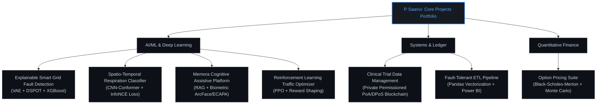

# P Saanvi

**AI/ML Engineer | Computer Science Student | Explainable AI & Quantitative ML**

Bengaluru, India | [Email](mailto:psaanvibhat@outlook.com) | [GitHub](https://github.com/PSaanviBhat) | [LinkedIn](https://linkedin.com/in/psaanvi)

---

### Profile Summary
I am an undergraduate Computer Science student at PES University specializing in Artificial Intelligence and Machine Learning. I design and build high-performance, data-driven AI systems and quantitative pipelines that solve real-world problems. My experience spans **sensor telemetry, time-series anomaly detection, explainable AI (XAI) and deep learning**. I focus on constructing production-grade ML architectures, robust ETL systems, and low-latency inference modules.

---

## Technical Stack

<table style="border-collapse: collapse; border: none;">
  <tr style="border: none; background: transparent;">
    <!-- Languages Card -->
    <td align="center" valign="top" style="border: 1px solid #30363d; border-radius: 8px; padding: 20px 15px; background-color: #0d1117; width: 220px;">
      Languages
         
      

        
        
        
        
        
      

    </td>
    <td style="width: 15px; border: none; background: transparent;"></td>
    <!-- ML & Quant Card -->
    <td align="center" valign="top" style="border: 1px solid #30363d; border-radius: 8px; padding: 20px 15px; background-color: #0d1117; width: 220px;">
      ML & Quant
         
      

        
        
        
        
        
        
        
      

    </td>
    <td style="width: 15px; border: none; background: transparent;"></td>
    <!-- Systems & Ledger Card -->
    <td align="center" valign="top" style="border: 1px solid #30363d; border-radius: 8px; padding: 20px 15px; background-color: #0d1117; width: 220px;">
      Systems & Ledger
         
      

        
        
        
        
        
        
        
        
      

    </td>
    <td style="width: 15px; border: none; background: transparent;"></td>
    <!-- Web & DevOps Card -->
    <td align="center" valign="top" style="border: 1px solid #30363d; border-radius: 8px; padding: 20px 15px; background-color: #0d1117; width: 220px;">
      Web & DevOps
         
      

        
        
        
        
        
        
        
        
        
        
      

    </td>
  </tr>
</table>

---

## Projects Portfolio

## GitHub Statistics

| **Core Developer Metrics** | **Streaks & Language Breakdown** |
| :---: | :---: |
|  |      |

---

## Research Interests & Focus

* **Explainable AI (XAI)** – Restoring interpretability in deep black-box models.
* **Quantitative Machine Learning** – Appling statistical modeling and ML to financial markets and telemetry data.
* **Reinforcement Learning and Deep Learning** – Sequential decision-making, game theory, and adaptive control systems.
* **Intelligent Edge Systems** – Deploying low-latency ML and cryptographic verification to edge nodes/IoT devices.

---

## Open to Collaboration

I am keen to collaborate on **AI research, open-source ML systems, and quantitative modeling projects**. If you are building in the ML/AI, Quant, or Decentralized Systems spaces, let's connect!

*Last updated: July 2026*

