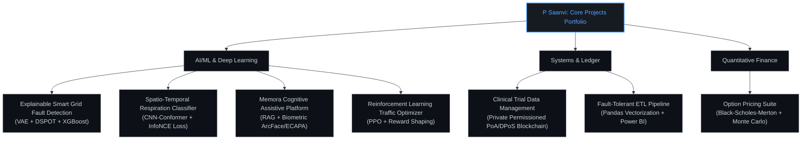

# P Saanvi

**AI/ML Engineer | Computer Science Student | Explainable AI & Quantitative ML**

Bengaluru, India | [Email](mailto:psaanvibhat@outlook.com) | [GitHub](https://github.com/PSaanviBhat) | [LinkedIn](https://linkedin.com/in/psaanvi)

---

### Profile Summary
I am an undergraduate Computer Science student at PES University specializing in Artificial Intelligence and Machine Learning. I design and build high-performance, data-driven AI systems and quantitative pipelines that solve real-world problems. My experience spans **sensor telemetry, time-series anomaly detection, explainable AI (XAI) and deep learning**. I focus on constructing production-grade ML architectures, robust ETL systems, and low-latency inference modules.

---

## Technical Stack

<table style="border-collapse: collapse; border: none;">
  <tr style="border: none; background: transparent;">
    <!-- Languages Card -->
    <td align="center" valign="top" style="border: 1px solid #30363d; border-radius: 8px; padding: 20px 15px; background-color: #0d1117; width: 220px;">
      Languages
         
      

        
        
        
        
        
      

    </td>
    <td style="width: 15px; border: none; background: transparent;"></td>
    <!-- ML & Quant Card -->
    <td align="center" valign="top" style="border: 1px solid #30363d; border-radius: 8px; padding: 20px 15px; background-color: #0d1117; width: 220px;">
      ML & Quant
         
      

        
        
        
        
        
        
        
      

    </td>
    <td style="width: 15px; border: none; background: transparent;"></td>
    <!-- Systems & Ledger Card -->
    <td align="center" valign="top" style="border: 1px solid #30363d; border-radius: 8px; padding: 20px 15px; background-color: #0d1117; width: 220px;">
      Systems & Ledger
         
      

        
        
        
        
        
        
        
        
      

    </td>
    <td style="width: 15px; border: none; background: transparent;"></td>
    <!-- Web & DevOps Card -->
    <td align="center" valign="top" style="border: 1px solid #30363d; border-radius: 8px; padding: 20px 15px; background-color: #0d1117; width: 220px;">
      Web & DevOps
         
      

        
        
        
        
        
        
        
        
        
        
      

    </td>
  </tr>
</table>

---

## Projects Portfolio

<table width="100%" style="border-collapse: collapse; border: none; table-layout: fixed;">
  <tr style="border: none; background: transparent;">
    <!-- Project 1 -->
    <td valign="top" style="border: 1px solid #30363d; border-radius: 8px; padding: 18px; background-color: #0d1117; width: 48%;">
      
      <h3 style="margin-top: 5px; margin-bottom: 10px;"><a href="https://github.com/PSaanviBhat/-SmartGridAnomalyDetection" style="color: #c9d1d9; text-decoration: none;">Smart Grid Fault Detector</a></h3>
      

        Engineered a hybrid unsupervised-supervised anomaly detection pipeline achieving a 0.9959 F1-score and 96.85% classification accuracy in smart grid telemetry using VAEs and DSPOT adaptive thresholding.
      

       
      

        
<small><b>View Details & Mathematics</b></small>

        

           
          <b>Target Metrics:</b>
          <ul>
            <li>Anomaly Detection F1-Score: <b>0.9959</b> (16x improvement in precision over Isolation Forest/One-Class SVM baselines).</li>
            <li>Fault Classification Accuracy: <b>96.85%</b> (0.9676 cross-validation F1).</li>
          </ul>
          <b>DSPOT Threshold Optimization:</b>
          $$V_{th} = X_p + \frac{Y_p}{\gamma} \left( \left(\frac{k}{n}\right)^{-\gamma} - 1 \right)$$
          <b>Flowchart:</b>
          <pre>
Telemetry Data ➔ VAE Reconstruction ➔ DSPOT Adaptive Threshold ➔ Latent Space Augmentation ➔ XGBoost Classifier ➔ SHAP Explanations
          </pre>
          <b>Core Stack:</b> VAEs, XGBoost, SHAP/TreeSHAP, Extreme Value Theory, Multivariate Sensor Telemetry.
        

      

    </td>
    <!-- Spacer -->
    <td style="width: 4%; border: none; background: transparent;"></td>
    <!-- Project 2 -->
    <td valign="top" style="border: 1px solid #30363d; border-radius: 8px; padding: 18px; background-color: #0d1117; width: 48%;">
      
      <h3 style="margin-top: 5px; margin-bottom: 10px;"><a href="https://github.com/PSaanviBhat/Lung-Sound-Analysis-and-Respiratory-Disease-Classification-using-Deep-Learning" style="color: #c9d1d9; text-decoration: none;">Lung Sound Analysis</a></h3>
      

        Developed a PyTorch-based sequential classifier using a Cross-Attention Conformer architecture with multi-task learning and InfoNCE contrastive alignment, achieving a record 47.25% ICBHI score.
      

       
      

        
<small><b>View Details & Mathematics</b></small>

        

           
          <b>Target Metrics:</b>
          <ul>
            <li>Official ICBHI Score: <b>47.25%</b> under strict patient-wise partitions.</li>
            <li>Disease Pathologies Classification: <b>93.03%</b> accuracy at 4.36ms/cycle latency.</li>
          </ul>
          <b>Contrastive Alignment via InfoNCE Loss:</b>
          $$\mathcal{L}_{\text{InfoNCE}} = -\log \frac{\exp(\text{sim}(q, k_+)/\tau)}{\sum_i \exp(\text{sim}(q, k_i)/\tau)}$$
          <b>Homoscedastic Uncertainty Optimization:</b>
          $$\mathcal{L}_{\text{MTL}}(W) = \frac{1}{2\sigma_1^2}\mathcal{L}_1(W) + \frac{1}{2\sigma_2^2}\mathcal{L}_2(W) + \log(\sigma_1\sigma_2)$$
          <b>Core Stack:</b> PyTorch, Signal Processing (Mel Spectrogram, CQT, CWT), Conformer, InfoNCE Loss, Multi-Task Learning.
        

      

    </td>
  </tr>
  <tr style="height: 20px; border: none; background: transparent;"><td colspan="3" style="border: none; background: transparent;"></td></tr>
  <tr style="border: none; background: transparent;">
    <!-- Project 3 -->
    <td valign="top" style="border: 1px solid #30363d; border-radius: 8px; padding: 18px; background-color: #0d1117; width: 48%;">
      
      <h3 style="margin-top: 5px; margin-bottom: 10px;"><a href="https://github.com/PSaanviBhat/private-blockchain-clinicaltrial" style="color: #c9d1d9; text-decoration: none;">Clinical Trial Ledger</a></h3>
      

        Designed and deployed a private permissioned blockchain network using hybrid PoA + DPoS consensus and SHA-256 hashing to secure clinical data with a pre-chain ML fraud gate.
      

       
      

        
<small><b>View Details & Security Flow</b></small>

        

           
          <b>Target Metrics:</b>
          <ul>
            <li>Fraud Gate Precision: <b>100%</b> (86.82% accuracy) at 16.4ms inference latency.</li>
            <li>Chain Validation Complexity: <b>O(1)</b> hash-chain lookup per transaction.</li>
          </ul>
          <b>Consensus Flow:</b>
          <pre>
Clinical Trial Record ➔ XGBoost Fraud Gate ➔ Hybrid PoA+DPoS consensus ➔ Solidity Validation ➔ IPFS (AES-256-GCM) ➔ Block Commit
          </pre>
          <b>Core Stack:</b> Solidity, Blockchain (PoA/DPoS), AES-256-GCM, SHA-256, IPFS, XGBoost.
        

      

    </td>
    <!-- Spacer -->
    <td style="width: 4%; border: none; background: transparent;"></td>
    <!-- Project 4 -->
    <td valign="top" style="border: 1px solid #30363d; border-radius: 8px; padding: 18px; background-color: #0d1117; width: 48%;">
      
      <h3 style="margin-top: 5px; margin-bottom: 10px;"><a href="https://github.com/PSaanviBhat/Memora-AR-Based-Cognitive-Assistive-Platform" style="color: #c9d1d9; text-decoration: none;">Memora Assistive Platform</a></h3>
      

        Architected an end-to-end multimodal AI system integrating biometric face/voice recognition with a ChromaDB Retrieval-Augmented Generation memory pipeline for Alzheimer's patients.
      

       
      

        
<small><b>View Details & Architecture</b></small>

        

           
          <b>Target Metrics:</b>
          <ul>
            <li>Memory Retrieval Latency: <b>Sub-second (&lt;1.0s)</b>.</li>
            <li>Biometric Gates: ArcFace (facial) + ECAPA-TDNN (voice) identity recognition.</li>
          </ul>
          <b>conversational Flow:</b>
          <pre>
Whisper STT ➔ Qwen LLM (RAG over ChromaDB memory) ➔ Coqui TTS synthesis
          </pre>
          <b>Core Stack:</b> ArcFace, ECAPA-TDNN, ChromaDB Vector DB, RAG, Qwen LLM, Whisper STT, Coqui TTS.
        

      

    </td>
  </tr>
  <tr style="height: 20px; border: none; background: transparent;"><td colspan="3" style="border: none; background: transparent;"></td></tr>
  <tr style="border: none; background: transparent;">
    <!-- Project 5 -->
    <td valign="top" style="border: 1px solid #30363d; border-radius: 8px; padding: 18px; background-color: #0d1117; width: 48%;">
      
      <h3 style="margin-top: 5px; margin-bottom: 10px;"><a href="https://github.com/PSaanviBhat/Option-Pricing-Sensitivity-Analysis-Suite" style="color: #c9d1d9; text-decoration: none;">Option Pricing Suite</a></h3>
      

        Implemented a quant suite featuring a Black-Scholes-Merton pricing engine, a Monte Carlo simulator with 95% confidence intervals, and a robust Implied Volatility solver.
      

       
      

        
<small><b>View Details & Mathematics</b></small>

        

           
          <b>Black-Scholes Call Valuation:</b>
          $$C = S_t N(d_1) - K e^{-r(T-t)} N(d_2)$$
          <b>Portfolio Greeks Integration:</b>
          Computes portfolio Greeks (Delta, Gamma, Theta, Vega, Rho) as weighted linear combinations across legs to enable real-time risk/strategy sensitivity analyses.
            
          <b>Core Stack:</b> Python, NumPy, SciPy, Streamlit.
        

      

    </td>
    <!-- Spacer -->
    <td style="width: 4%; border: none; background: transparent;"></td>
    <!-- Project 6 -->
    <td valign="top" style="border: 1px solid #30363d; border-radius: 8px; padding: 18px; background-color: #0d1117; width: 48%;">
      
      <h3 style="margin-top: 5px; margin-bottom: 10px;">Fault-Tolerant ETL Pipeline</h3>
      

        Engineered a production-grade Python ETL pipeline ingesting records from external REST APIs through automated schema normalization, vectorized Pandas transforms, and backoff decorators.
      

       
      

        
<small><b>View Details & Analytics</b></small>

        

           
          <b>Target Metrics:</b>
          <ul>
            <li>Failure Reduction: <b>0%</b> transient API failure impact due to exponential backoff and SSL verified sessions.</li>
            <li>Reliability: Covered with 20+ automated Pytest unit tests mocking network latency, schema mismatches, and file corruptions.</li>
          </ul>
          <b>Core Stack:</b> Python, Pandas, REST APIs, Pytest, Power BI, Exponential Backoff.
        

      

    </td>
  </tr>
  <tr style="height: 20px; border: none; background: transparent;"><td colspan="3" style="border: none; background: transparent;"></td></tr>
  <tr style="border: none; background: transparent;">
    <!-- Project 7 -->
    <td valign="top" style="border: 1px solid #30363d; border-radius: 8px; padding: 18px; background-color: #0d1117; width: 48%;">
      
      <h3 style="margin-top: 5px; margin-bottom: 10px;"><a href="https://github.com/PSaanviBhat/Reinforcement-Learning-Intelligent-Traffic-Light-Controller" style="color: #c9d1d9; text-decoration: none;">Traffic Signal Optimizer</a></h3>
      

        Trained a Proximal Policy Optimization (PPO)-based deep reinforcement learning agent in a custom Gymnasium environment to minimize vehicle waiting times dynamically.
      

       
      

        
<small><b>View Details & Training</b></small>

        

           
          <b>Adaptive Control Flow:</b>
          <ul>
            <li>Engineered multi-term reward functions balancing waiting times, emergency vehicles, and tail congestion.</li>
            <li>Implemented learning-rate annealing to stabilize learning convergence across unseen traffic distributions.</li>
          </ul>
          <b>Core Stack:</b> Gymnasium, PPO (Stable Baselines3), Custom traffic simulation.
        

      

    </td>
    <!-- Spacer -->
    <td style="width: 4%; border: none; background: transparent;"></td>
    <!-- Project 8 -->
    <td valign="top" style="border: 1px solid #30363d; border-radius: 8px; padding: 18px; background-color: #0d1117; width: 48%;">
      
      <h3 style="margin-top: 5px; margin-bottom: 10px;"><a href="https://github.com/PSaanviBhat/civic-spark" style="color: #c9d1d9; text-decoration: none;">Civic-Spark Platform</a></h3>
      

        Architected a mobile-first citizen advocacy portal for Bengaluru using OpenStreetMap tracking and a decay-weighted priority algorithm to rank civic issues.
      

       
      

        
<small><b>View Details & Features</b></small>

        

           
          <b>Key Gamification Details:</b>
          <ul>
            <li>Integrated XP/badges, daily streaks, 5 citizen progression tiers, and a weighted upvote scoring system.</li>
            <li>Spam Prevention: Trust index balancing upvotes, user reputation levels, and location timestamps.</li>
          </ul>
          <b>Core Stack:</b> React 18, TypeScript, Vite, Tailwind CSS, React Leaflet, Radix UI, TanStack Query.
        

      

    </td>
  </tr>
</table>

---

## GitHub Statistics

| **Core Developer Metrics** | **Streaks & Language Breakdown** |
| :---: | :---: |
|  |      |

---

## Research Interests & Focus

* **Explainable AI (XAI)** – Restoring interpretability in deep black-box models.
* **Quantitative Machine Learning** – Appling statistical modeling and ML to financial markets and telemetry data.
* **Reinforcement Learning** – Sequential decision-making, game theory, and adaptive control systems.
* **Intelligent Edge Systems** – Deploying low-latency ML and cryptographic verification to edge nodes/IoT devices.

---

## Open to Collaboration

I am keen to collaborate on **AI research, open-source ML systems, and quantitative modeling projects**. If you are building in the ML/AI, Quant, or Decentralized Systems spaces, let's connect!

*Last updated: July 2026*

